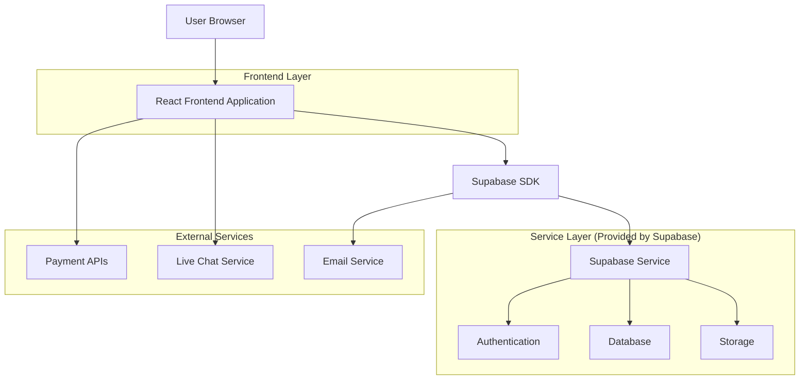
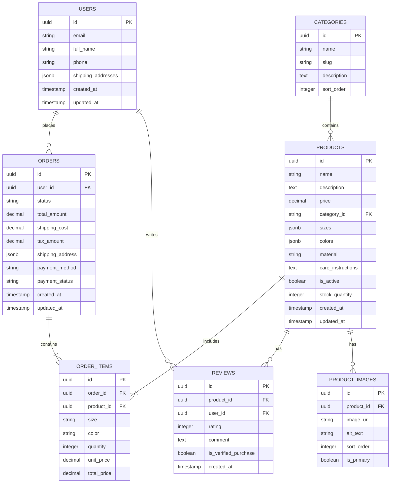

# Women's Fashion E-commerce Platform - Technical Architecture Document

## 1. Architecture Design



## 2. Technology Description

* Frontend: React\@18 + TypeScript + TailwindCSS\@3 + Vite + React Router

* Backend: Supabase (Authentication, Database, Storage)

* Payment Processing: Stripe (Visa, PayPal, Apple Pay), Klarna API

* Live Chat: Intercom or Zendesk Chat

* Email Service: Supabase Auth + SendGrid for transactional emails

* Image Optimization: Supabase Storage with CDN

## 3. Route Definitions

| Route               | Purpose                                                  |
| ------------------- | -------------------------------------------------------- |
| /                   | Homepage with hero banner, new arrivals, and bestsellers |
| /products           | Product listing page with search and filters             |
| /products/:category | Category-specific product listings                       |
| /product/:id        | Individual product detail page                           |
| /cart               | Shopping cart management                                 |
| /checkout           | Checkout process with shipping and payment               |
| /login              | User authentication page                                 |
| /register           | User registration page                                   |
| /account            | User account dashboard                                   |
| /account/orders     | Order history and tracking                               |
| /account/profile    | Profile management                                       |
| /support            | Customer support page                                    |
| /coming-soon        | Placeholder for unimplemented features                   |

## 4. API Definitions

### 4.1 Core API

**Product Management**

```
GET /api/products
```

Request:

| Param Name | Param Type | isRequired | Description                |
| ---------- | ---------- | ---------- | -------------------------- |
| category   | string     | false      | Filter by product category |
| search     | string     | false      | Search term for products   |
| minPrice   | number     | false      | Minimum price filter       |
| maxPrice   | number     | false      | Maximum price filter       |
| size       | string     | false      | Size filter                |
| color      | string     | false      | Color filter               |
| page       | number     | false      | Page number for pagination |
| limit      | number     | false      | Number of items per page   |

Response:

| Param Name | Param Type | Description                         |
| ---------- | ---------- | ----------------------------------- |
| products   | Product\[] | Array of product objects            |
| totalCount | number     | Total number of products            |
| hasMore    | boolean    | Whether more products are available |

**Order Management**

```
POST /api/orders
```

Request:

| Param Name      | Param Type  | isRequired | Description                         |
| --------------- | ----------- | ---------- | ----------------------------------- |
| items           | CartItem\[] | true       | Array of cart items                 |
| shippingAddress | Address     | true       | Shipping address object             |
| paymentMethod   | string      | true       | Payment method identifier           |
| paymentToken    | string      | true       | Payment token from payment provider |

Response:

| Param Name        | Param Type | Description             |
| ----------------- | ---------- | ----------------------- |
| orderId           | string     | Unique order identifier |
| status            | string     | Order status            |
| totalAmount       | number     | Total order amount      |
| estimatedDelivery | string     | Estimated delivery date |

Example:

```json
{
  "items": [
    {
      "productId": "prod_123",
      "size": "M",
      "color": "black",
      "quantity": 2,
      "price": 29.99
    }
  ],
  "shippingAddress": {
    "street": "123 Main St",
    "city": "New York",
    "state": "NY",
    "zipCode": "10001",
    "country": "US"
  },
  "paymentMethod": "stripe",
  "paymentToken": "tok_1234567890"
}
```

## 5. Data Model

### 5.1 Data Model Definition



### 5.2 Data Definition Language

**Users Table**

```sql
-- Create users table
CREATE TABLE users (
    id UUID PRIMARY KEY DEFAULT gen_random_uuid(),
    email VARCHAR(255) UNIQUE NOT NULL,
    full_name VARCHAR(100) NOT NULL,
    phone VARCHAR(20),
    shipping_addresses JSONB DEFAULT '[]',
    created_at TIMESTAMP WITH TIME ZONE DEFAULT NOW(),
    updated_at TIMESTAMP WITH TIME ZONE DEFAULT NOW()
);

-- Enable RLS
ALTER TABLE users ENABLE ROW LEVEL SECURITY;

-- Create policies
CREATE POLICY "Users can view own profile" ON users
    FOR SELECT USING (auth.uid() = id);

CREATE POLICY "Users can update own profile" ON users
    FOR UPDATE USING (auth.uid() = id);

-- Grant permissions
GRANT SELECT ON users TO authenticated;
GRANT UPDATE ON users TO authenticated;
```

**Products Table**

```sql
-- Create categories table
CREATE TABLE categories (
    id UUID PRIMARY KEY DEFAULT gen_random_uuid(),
    name VARCHAR(100) NOT NULL,
    slug VARCHAR(100) UNIQUE NOT NULL,
    description TEXT,
    sort_order INTEGER DEFAULT 0
);

-- Create products table
CREATE TABLE products (
    id UUID PRIMARY KEY DEFAULT gen_random_uuid(),
    name VARCHAR(200) NOT NULL,
    description TEXT,
    price DECIMAL(10,2) NOT NULL,
    category_id UUID REFERENCES categories(id),
    sizes JSONB DEFAULT '[]',
    colors JSONB DEFAULT '[]',
    material VARCHAR(100),
    care_instructions TEXT,
    is_active BOOLEAN DEFAULT true,
    stock_quantity INTEGER DEFAULT 0,
    created_at TIMESTAMP WITH TIME ZONE DEFAULT NOW(),
    updated_at TIMESTAMP WITH TIME ZONE DEFAULT NOW()
);

-- Create product images table
CREATE TABLE product_images (
    id UUID PRIMARY KEY DEFAULT gen_random_uuid(),
    product_id UUID REFERENCES products(id) ON DELETE CASCADE,
    image_url TEXT NOT NULL,
    alt_text VARCHAR(200),
    sort_order INTEGER DEFAULT 0,
    is_primary BOOLEAN DEFAULT false
);

-- Create indexes
CREATE INDEX idx_products_category ON products(category_id);
CREATE INDEX idx_products_price ON products(price);
CREATE INDEX idx_products_active ON products(is_active);
CREATE INDEX idx_product_images_product ON product_images(product_id);

-- Grant permissions
GRANT SELECT ON categories TO anon, authenticated;
GRANT SELECT ON products TO anon, authenticated;
GRANT SELECT ON product_images TO anon, authenticated;
```

**Orders Table**

```sql
-- Create orders table
CREATE TABLE orders (
    id UUID PRIMARY KEY DEFAULT gen_random_uuid(),
    user_id UUID REFERENCES auth.users(id),
    status VARCHAR(50) DEFAULT 'pending',
    total_amount DECIMAL(10,2) NOT NULL,
    shipping_cost DECIMAL(10,2) DEFAULT 0,
    tax_amount DECIMAL(10,2) DEFAULT 0,
    shipping_address JSONB NOT NULL,
    payment_method VARCHAR(50) NOT NULL,
    payment_status VARCHAR(50) DEFAULT 'pending',
    created_at TIMESTAMP WITH TIME ZONE DEFAULT NOW(),
    updated_at TIMESTAMP WITH TIME ZONE DEFAULT NOW()
);

-- Create order items table
CREATE TABLE order_items (
    id UUID PRIMARY KEY DEFAULT gen_random_uuid(),
    order_id UUID REFERENCES orders(id) ON DELETE CASCADE,
    product_id UUID REFERENCES products(id),
    size VARCHAR(10),
    color VARCHAR(50),
    quantity INTEGER NOT NULL,
    unit_price DECIMAL(10,2) NOT NULL,
    total_price DECIMAL(10,2) NOT NULL
);

-- Create reviews table
CREATE TABLE reviews (
    id UUID PRIMARY KEY DEFAULT gen_random_uuid(),
    product_id UUID REFERENCES products(id) ON DELETE CASCADE,
    user_id UUID REFERENCES auth.users(id),
    rating INTEGER CHECK (rating >= 1 AND rating <= 5),
    comment TEXT,
    is_verified_purchase BOOLEAN DEFAULT false,
    created_at TIMESTAMP WITH TIME ZONE DEFAULT NOW()
);

-- Create indexes
CREATE INDEX idx_orders_user ON orders(user_id);
CREATE INDEX idx_orders_status ON orders(status);
CREATE INDEX idx_order_items_order ON order_items(order_id);
CREATE INDEX idx_reviews_product ON reviews(product_id);
CREATE INDEX idx_reviews_rating ON reviews(rating);

-- Enable RLS
ALTER TABLE orders ENABLE ROW LEVEL SECURITY;
ALTER TABLE order_items ENABLE ROW LEVEL SECURITY;
ALTER TABLE reviews ENABLE ROW LEVEL SECURITY;

-- Create policies
CREATE POLICY "Users can view own orders" ON orders
    FOR SELECT USING (auth.uid() = user_id);

CREATE POLICY "Users can create orders" ON orders
    FOR INSERT WITH CHECK (auth.uid() = user_id);

CREATE POLICY "Users can view own order items" ON order_items
    FOR SELECT USING (EXISTS (
        SELECT 1 FROM orders WHERE orders.id = order_items.order_id AND orders.user_id = auth.uid()
    ));

CREATE POLICY "Anyone can view reviews" ON reviews
    FOR SELECT TO anon, authenticated;

CREATE POLICY "Authenticated users can create reviews" ON reviews
    FOR INSERT TO authenticated WITH CHECK (auth.uid() = user_id);

-- Grant permissions
GRANT SELECT ON orders TO authenticated;
GRANT INSERT ON orders TO authenticated;
GRANT SELECT ON order_items TO authenticated;
GRANT INSERT ON order_items TO authenticated;
GRANT SELECT ON reviews TO anon, authenticated;
GRANT INSERT ON reviews TO authenticated;
```

**Initial Data**

```sql
-- Insert sample categories
INSERT INTO categories (name, slug, description, sort_order) VALUES
('Dresses', 'dresses', 'Elegant dresses for every occasion', 1),
('Tops', 'tops', 'Stylish tops and blouses', 2),
('Bottoms', 'bottoms', 'Pants, jeans, and skirts', 3),
('Outerwear', 'outerwear', 'Jackets and coats', 4),
('Accessories', 'accessories', 'Bags, jewelry, and more', 5);
```

