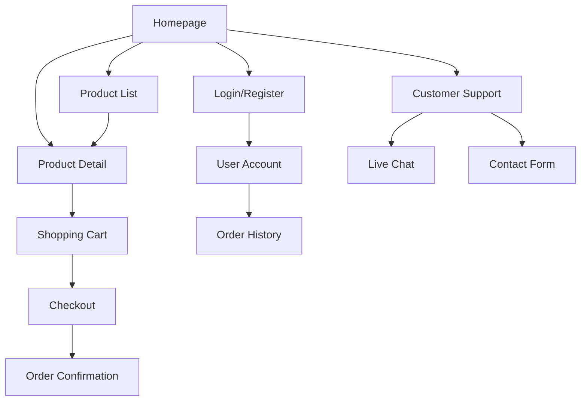

# Women's Fashion E-commerce Platform - Product Requirements Document

## 1. Product Overview
A modern women's fashion e-commerce platform targeting US and European markets, inspired by Zara and H&M's clean aesthetic and user experience.

The platform aims to provide a seamless shopping experience for fashion-conscious women aged 18-45, offering trendy clothing with fast fashion principles. The product will compete in the $50B+ global fast fashion market by delivering an intuitive, mobile-first shopping experience with comprehensive payment options and customer support.

## 2. Core Features

### 2.1 User Roles
| Role | Registration Method | Core Permissions |
|------|---------------------|------------------|
| Guest User | No registration required | Browse products, view details, add to cart |
| Registered User | Email registration | Full shopping access, order history, saved items, reviews |
| Customer Support | Internal invitation | Access to live chat, order management, customer queries |

### 2.2 Feature Module
Our fashion e-commerce platform consists of the following main pages:
1. **Homepage**: hero banner, new arrivals section, bestsellers showcase, new user registration popup
2. **Product List Page**: product grid, search functionality, filtering system, sorting options
3. **Product Detail Page**: product image gallery, size selection, product information, customer reviews
4. **Shopping Cart**: item management, quantity adjustment, price calculation, checkout initiation
5. **Checkout Page**: shipping information, payment method selection, order summary
6. **User Account Pages**: login/registration, order history, profile management
7. **Customer Support**: live chat interface, contact form

### 2.3 Page Details
| Page Name | Module Name | Feature description |
|-----------|-------------|---------------------|
| Homepage | Hero Banner | Display rotating promotional banners with call-to-action buttons |
| Homepage | New Arrivals | Show latest 8-12 products with quick view and add to cart options |
| Homepage | Bestsellers | Display top-selling items with ratings and quick purchase options |
| Homepage | New User Popup | Modal for email signup with discount incentive for first-time visitors |
| Product List | Search Bar | Real-time search with autocomplete and product suggestions |
| Product List | Filter System | Filter by size, color, price range, brand, category, and availability |
| Product List | Product Grid | Display products with image, name, price, and quick actions |
| Product List | Sorting Options | Sort by price, popularity, newest, ratings, and relevance |
| Product Detail | Image Gallery | Multiple product images with zoom functionality and 360-degree view |
| Product Detail | Size Guide | Interactive size chart with fit recommendations |
| Product Detail | Product Info | Detailed description, materials, care instructions, and specifications |
| Product Detail | Reviews Section | Customer reviews with ratings, photos, and helpful voting system |
| Product Detail | Add to Cart | Size selection, quantity picker, and cart addition with confirmation |
| Shopping Cart | Item Management | View items, modify quantities, remove products, save for later |
| Shopping Cart | Price Calculator | Subtotal, shipping costs, taxes, discounts, and total calculation |
| Shopping Cart | Checkout Button | Proceed to secure checkout with guest or registered user options |
| Checkout | Shipping Form | Address input, delivery options, and estimated delivery dates |
| Checkout | Payment Methods | Support for Visa, PayPal, Apple Pay, and Klarna payment options |
| Checkout | Order Summary | Final review of items, pricing, and terms before purchase completion |
| User Account | Login/Register | Email-based authentication with password reset functionality |
| User Account | Order History | View past orders, track shipments, reorder items, and download invoices |
| User Account | Profile Management | Update personal information, shipping addresses, and preferences |
| Customer Support | Live Chat | Real-time messaging with support agents during business hours |
| Customer Support | Contact Form | Email-based support for non-urgent queries and feedback |

## 3. Core Process

**Guest User Shopping Flow:**
Guest users can browse the homepage, search and filter products, view product details, and add items to cart. During checkout, they can either complete purchase as guest by providing shipping information and payment details, or create an account for future convenience.

**Registered User Shopping Flow:**
Registered users enjoy the full experience including personalized recommendations, order history access, saved items, and streamlined checkout with stored payment and shipping information. They can also leave product reviews and track order status.

**Customer Support Flow:**
Users can access support through live chat for immediate assistance or submit queries via contact form. Support agents can view order history and provide personalized assistance to registered users.

## 4. User Interface Design

### 4.1 Design Style
- **Primary Colors**: Black (#000000), White (#FFFFFF), Light Gray (#F5F5F5)
- **Secondary Colors**: Soft Beige (#F7F3E9), Navy Blue (#1B2951)
- **Button Style**: Minimalist rectangular buttons with subtle hover animations and rounded corners (4px radius)
- **Typography**: Clean sans-serif fonts - Primary: 16px, Headers: 24-32px, Captions: 14px
- **Layout Style**: Card-based product displays, top navigation with mega menu, sticky header
- **Icons**: Unified minimalist line icons (shopping bag, heart, user, search, filter)
- **Animations**: Subtle fade-ins, smooth transitions (300ms), hover effects on interactive elements

### 4.2 Page Design Overview
| Page Name | Module Name | UI Elements |
|-----------|-------------|-------------|
| Homepage | Hero Banner | Full-width image slider with overlay text, CTA buttons with hover animations |
| Homepage | Product Sections | Clean grid layout with product cards, subtle shadows, hover zoom effects |
| Product List | Filter Sidebar | Collapsible filters with checkboxes, price sliders, color swatches |
| Product List | Product Grid | Responsive grid (4 cols desktop, 2 cols tablet, 1 col mobile) with lazy loading |
| Product Detail | Image Gallery | Large main image with thumbnail strip, zoom on hover, mobile swipe gestures |
| Product Detail | Product Info | Structured layout with clear typography hierarchy and prominent CTA buttons |
| Shopping Cart | Item List | Clean table layout with product images, quantity controls, and remove options |
| Checkout | Form Layout | Single-column form with clear sections, progress indicator, and validation states |

### 4.3 Responsiveness
Mobile-first responsive design optimized for touch interactions. Breakpoints: Mobile (320-768px), Tablet (768-1024px), Desktop (1024px+). Touch-optimized buttons (minimum 44px), swipe gestures for image galleries, and collapsible navigation for mobile devices.