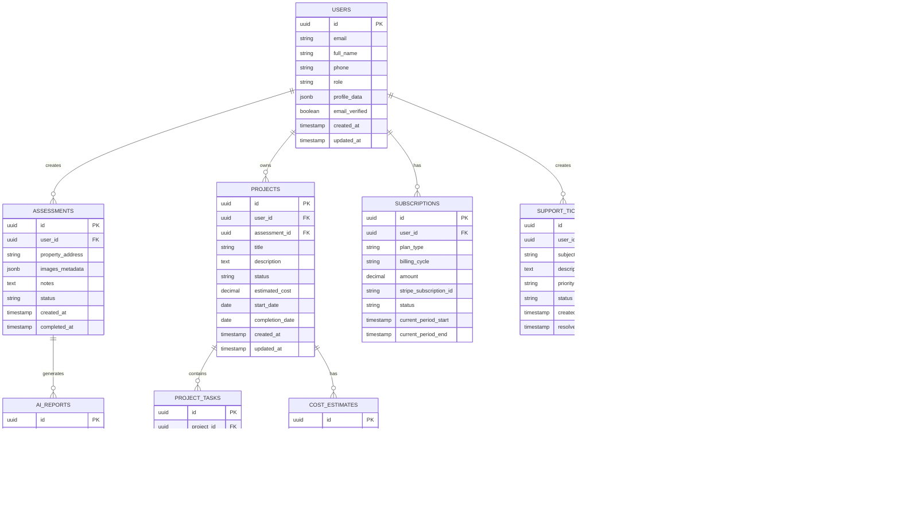

# OrPaynter AI Platform - Technical Architecture Document

## 1. Architecture Design


## 2. Technology Description

* **Frontend**: React\@18 + TypeScript + TailwindCSS\@3 + Vite + React Router + PWA

* **Backend**: Supabase (Authentication, Database, Storage, Real-time)

* **AI Processing**: OpenAI GPT-4 Vision API, Custom Computer Vision Models

* **Payment Processing**: Stripe (cards, ACH), PayPal, Apple Pay integration

* **Live Chat**: Intercom or Zendesk Chat

* **Email Service**: Supabase Auth + SendGrid for transactional emails

* **SMS Service**: Twilio for notifications and alerts

* **File Storage**: Supabase Storage with CDN for roof images and reports

* **Analytics**: Mixpanel or PostHog for user behavior tracking

## 3. Route Definitions

| Route                 | Purpose                                                |
| --------------------- | ------------------------------------------------------ |
| /                     | Homepage with hero banner, trust metrics, and CTAs     |
| /assessment           | AI assessment form with photo upload                   |
| /dashboard            | Role-based dashboard (redirects based on user role)    |
| /dashboard/homeowner  | Homeowner dashboard with roof health and alerts        |
| /dashboard/contractor | Contractor dashboard with leads and project management |
| /dashboard/insurance  | Insurance dashboard with claims and fraud detection    |
| /dashboard/supplier   | Supplier dashboard with inventory and forecasts        |
| /projects             | Project list with search and filters                   |
| /projects/:id         | Individual project detail page                         |
| /payment              | Payment and subscription management                    |
| /checkout             | Secure checkout flow                                   |
| /login                | User authentication page                               |
| /register             | User registration with role selection                  |
| /profile              | User profile and account settings                      |
| /support              | Customer support center                                |
| /reports/:id          | AI-generated roof reports                              |
| /coming-soon          | Placeholder for unimplemented features                 |

## 4. API Definitions

### 4.1 Core API

**AI Assessment Processing**

```
POST /api/assessments
```

Request:

| Param Name | Param Type | isRequired | Description                                         |
| ---------- | ---------- | ---------- | --------------------------------------------------- |
| name       | string     | true       | User's full name                                    |
| email      | string     | true       | Contact email address                               |
| phone      | string     | true       | Phone number                                        |
| role       | string     | true       | User role (homeowner/contractor/insurance/supplier) |
| address    | string     | true       | Property address                                    |
| images     | File\[]    | true       | Roof images for AI analysis                         |
| notes      | string     | false      | Additional notes or concerns                        |

Response:

| Param Name          | Param Type | Description                  |
| ------------------- | ---------- | ---------------------------- |
| assessmentId        | string     | Unique assessment identifier |
| status              | string     | Processing status            |
| estimatedCompletion | string     | Expected completion time     |

**Project Management**

```
GET /api/projects
```

Request:

| Param Name | Param Type | isRequired | Description              |
| ---------- | ---------- | ---------- | ------------------------ |
| userId     | string     | true       | User identifier          |
| status     | string     | false      | Filter by project status |
| search     | string     | false      | Search term              |
| page       | number     | false      | Page number              |
| limit      | number     | false      | Items per page           |

Response:

| Param Name | Param Type | Description                 |
| ---------- | ---------- | --------------------------- |
| projects   | Project\[] | Array of project objects    |
| totalCount | number     | Total number of projects    |
| hasMore    | boolean    | Whether more projects exist |

**Subscription Management**

```
POST /api/subscriptions
```

Request:

| Param Name      | Param Type | isRequired | Description                  |
| --------------- | ---------- | ---------- | ---------------------------- |
| planId          | string     | true       | Subscription plan identifier |
| paymentMethodId | string     | true       | Stripe payment method ID     |
| billingCycle    | string     | true       | monthly or annual            |

Response:

| Param Name     | Param Type | Description            |
| -------------- | ---------- | ---------------------- |
| subscriptionId | string     | Stripe subscription ID |
| status         | string     | Subscription status    |
| nextBilling    | string     | Next billing date      |

Example:

```json
{
  "name": "John Smith",
  "email": "john@example.com",
  "phone": "+1-555-0123",
  "role": "homeowner",
  "address": "123 Main St, Austin, TX 78701",
  "notes": "Possible hail damage from recent storm"
}
```

## 5. Server Architecture Diagram


## 6. Data Model

### 6.1 Data Model Definition



### 6.2 Data Definition Language

**Users Table**

```sql
-- Create users table (extends Supabase auth.users)
CREATE TABLE public.users (
    id UUID PRIMARY KEY REFERENCES auth.users(id) ON DELETE CASCADE,
    email VARCHAR(255) NOT NULL,
    full_name VARCHAR(100) NOT NULL,
    phone VARCHAR(20),
    role VARCHAR(20) NOT NULL CHECK (role IN ('homeowner', 'contractor', 'insurance', 'supplier')),
    profile_data JSONB DEFAULT '{}',
    email_verified BOOLEAN DEFAULT false,
    created_at TIMESTAMP WITH TIME ZONE DEFAULT NOW(),
    updated_at TIMESTAMP WITH TIME ZONE DEFAULT NOW()
);

-- Enable RLS
ALTER TABLE public.users ENABLE ROW LEVEL SECURITY;

-- Create policies
CREATE POLICY "Users can view own profile" ON public.users
    FOR SELECT USING (auth.uid() = id);

CREATE POLICY "Users can update own profile" ON public.users
    FOR UPDATE USING (auth.uid() = id);

-- Grant permissions
GRANT SELECT ON public.users TO authenticated;
GRANT UPDATE ON public.users TO authenticated;
GRANT INSERT ON public.users TO authenticated;
```

**Assessments Table**

```sql
-- Create assessments table
CREATE TABLE public.assessments (
    id UUID PRIMARY KEY DEFAULT gen_random_uuid(),
    user_id UUID REFERENCES public.users(id) ON DELETE CASCADE,
    property_address TEXT NOT NULL,
    images_metadata JSONB DEFAULT '[]',
    notes TEXT,
    status VARCHAR(50) DEFAULT 'pending' CHECK (status IN ('pending', 'processing', 'completed', 'failed')),
    created_at TIMESTAMP WITH TIME ZONE DEFAULT NOW(),
    completed_at TIMESTAMP WITH TIME ZONE
);

-- Create AI reports table
CREATE TABLE public.ai_reports (
    id UUID PRIMARY KEY DEFAULT gen_random_uuid(),
    assessment_id UUID REFERENCES public.assessments(id) ON DELETE CASCADE,
    damage_analysis JSONB NOT NULL,
    confidence_score DECIMAL(5,2) CHECK (confidence_score >= 0 AND confidence_score <= 100),
    recommendations JSONB DEFAULT '[]',
    summary TEXT,
    generated_at TIMESTAMP WITH TIME ZONE DEFAULT NOW()
);

-- Create indexes
CREATE INDEX idx_assessments_user_id ON public.assessments(user_id);
CREATE INDEX idx_assessments_status ON public.assessments(status);
CREATE INDEX idx_ai_reports_assessment ON public.ai_reports(assessment_id);

-- Enable RLS
ALTER TABLE public.assessments ENABLE ROW LEVEL SECURITY;
ALTER TABLE public.ai_reports ENABLE ROW LEVEL SECURITY;

-- Create policies
CREATE POLICY "Users can view own assessments" ON public.assessments
    FOR SELECT USING (auth.uid() = user_id);

CREATE POLICY "Users can create assessments" ON public.assessments
    FOR INSERT WITH CHECK (auth.uid() = user_id);

CREATE POLICY "Users can view reports for own assessments" ON public.ai_reports
    FOR SELECT USING (EXISTS (
        SELECT 1 FROM public.assessments 
        WHERE assessments.id = ai_reports.assessment_id 
        AND assessments.user_id = auth.uid()
    ));

-- Grant permissions
GRANT ALL ON public.assessments TO authenticated;
GRANT SELECT ON public.ai_reports TO authenticated;
```

**Projects Table**

```sql
-- Create projects table
CREATE TABLE public.projects (
    id UUID PRIMARY KEY DEFAULT gen_random_uuid(),
    user_id UUID REFERENCES public.users(id) ON DELETE CASCADE,
    assessment_id UUID REFERENCES public.assessments(id),
    title VARCHAR(200) NOT NULL,
    description TEXT,
    status VARCHAR(50) DEFAULT 'planning' CHECK (status IN ('planning', 'in_progress', 'completed', 'cancelled')),
    estimated_cost DECIMAL(12,2),
    start_date DATE,
    completion_date DATE,
    created_at TIMESTAMP WITH TIME ZONE DEFAULT NOW(),
    updated_at TIMESTAMP WITH TIME ZONE DEFAULT NOW()
);

-- Create project tasks table
CREATE TABLE public.project_tasks (
    id UUID PRIMARY KEY DEFAULT gen_random_uuid(),
    project_id UUID REFERENCES public.projects(id) ON DELETE CASCADE,
    title VARCHAR(200) NOT NULL,
    description TEXT,
    status VARCHAR(50) DEFAULT 'pending' CHECK (status IN ('pending', 'in_progress', 'completed')),
    assigned_to UUID REFERENCES public.users(id),
    due_date DATE,
    created_at TIMESTAMP WITH TIME ZONE DEFAULT NOW()
);

-- Create cost estimates table
CREATE TABLE public.cost_estimates (
    id UUID PRIMARY KEY DEFAULT gen_random_uuid(),
    project_id UUID REFERENCES public.projects(id) ON DELETE CASCADE,
    materials JSONB DEFAULT '[]',
    labor JSONB DEFAULT '[]',
    total_amount DECIMAL(12,2) NOT NULL,
    status VARCHAR(50) DEFAULT 'draft' CHECK (status IN ('draft', 'approved', 'rejected')),
    created_at TIMESTAMP WITH TIME ZONE DEFAULT NOW()
);

-- Create indexes
CREATE INDEX idx_projects_user_id ON public.projects(user_id);
CREATE INDEX idx_projects_status ON public.projects(status);
CREATE INDEX idx_project_tasks_project ON public.project_tasks(project_id);
CREATE INDEX idx_cost_estimates_project ON public.cost_estimates(project_id);

-- Enable RLS and create policies
ALTER TABLE public.projects ENABLE ROW LEVEL SECURITY;
ALTER TABLE public.project_tasks ENABLE ROW LEVEL SECURITY;
ALTER TABLE public.cost_estimates ENABLE ROW LEVEL SECURITY;

-- Grant permissions
GRANT ALL ON public.projects TO authenticated;
GRANT ALL ON public.project_tasks TO authenticated;
GRANT ALL ON public.cost_estimates TO authenticated;
```

**Subscriptions Table**

```sql
-- Create subscriptions table
CREATE TABLE public.subscriptions (
    id UUID PRIMARY KEY DEFAULT gen_random_uuid(),
    user_id UUID REFERENCES public.users(id) ON DELETE CASCADE,
    plan_type VARCHAR(50) NOT NULL CHECK (plan_type IN ('starter', 'pro', 'enterprise')),
    billing_cycle VARCHAR(20) NOT NULL CHECK (billing_cycle IN ('monthly', 'annual')),
    amount DECIMAL(10,2) NOT NULL,
    stripe_subscription_id VARCHAR(255) UNIQUE,
    status VARCHAR(50) DEFAULT 'active' CHECK (status IN ('active', 'cancelled', 'past_due', 'unpaid')),
    current_period_start TIMESTAMP WITH TIME ZONE,
    current_period_end TIMESTAMP WITH TIME ZONE,
    created_at TIMESTAMP WITH TIME ZONE DEFAULT NOW()
);

-- Create indexes
CREATE INDEX idx_subscriptions_user_id ON public.subscriptions(user_id);
CREATE INDEX idx_subscriptions_status ON public.subscriptions(status);

-- Enable RLS
ALTER TABLE public.subscriptions ENABLE ROW LEVEL SECURITY;

-- Create policies
CREATE POLICY "Users can view own subscriptions" ON public.subscriptions
    FOR SELECT USING (auth.uid() = user_id);

-- Grant permissions
GRANT SELECT ON public.subscriptions TO authenticated;
GRANT INSERT ON public.subscriptions TO authenticated;
GRANT UPDATE ON public.subscriptions TO authenticated;
```

**Initial Data**

```sql
-- Insert sample subscription plans (for reference)
INSERT INTO public.subscription_plans (name, price_monthly, price_annual, features) VALUES
('Starter', 29.99, 299.99, '["5 AI scans/month", "Basic reports", "Email support"]'),
('Pro', 99.99, 999.99, '["Unlimited AI scans", "Advanced analytics", "Priority support", "API access"]'),
('Enterprise', 299.99, 2999.99, '["White-label solution", "Dedicated support", "Custom integrations", "Advanced fraud detection"]');
```

