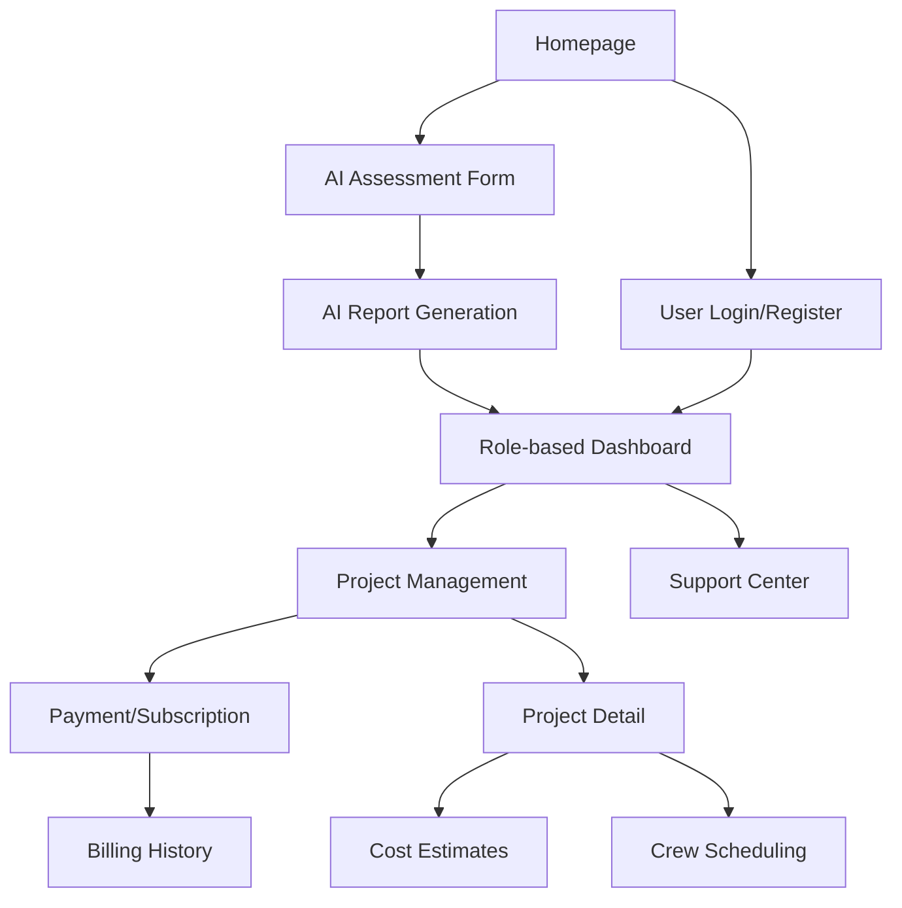

# OrPaynter AI Platform - Product Requirements Document

## 1. Product Overview

OrPaynter AI Platform is an AI-powered roofing intelligence platform targeting the US/Texas market with national expansion plans, embodying the mission: "AI Roofing Intelligence—Built by Roofers. Trusted by Giants."

The platform serves homeowners, contractors, insurance companies, and suppliers by providing AI-driven roof assessments, project management tools, and industry-specific workflows. It addresses the $50B+ roofing industry's need for accurate damage assessment, streamlined claims processing, and efficient project management through cutting-edge AI technology.

## 2. Core Features

### 2.1 User Roles

| Role       | Registration Method                        | Core Permissions                                             |
| ---------- | ------------------------------------------ | ------------------------------------------------------------ |
| Homeowner  | Email registration                         | AI scans, roof health monitoring, claim tracking             |
| Contractor | Email registration + verification          | Lead management, project tools, AI scan access               |
| Insurance  | Email registration + company verification  | Claims processing, fraud detection, standardized reports     |
| Supplier   | Email registration + business verification | Inventory management, demand forecasting, marketplace access |

### 2.2 Feature Module

Our OrPaynter AI platform consists of the following main pages:

1. **Homepage**: hero banner with tagline, trust metrics display, CTA buttons, new user signup popup
2. **AI Assessment Form**: comprehensive form with photo upload, role selection, contact information
3. **Role-based Dashboards**: customized interfaces for each user type with relevant metrics and tools
4. **Project Management**: project list with search/filters, detailed project views with AI scans
5. **Payment System**: secure checkout with multiple payment options and subscription management
6. **User Account Pages**: authentication, profile management, billing history
7. **Support Center**: live chat integration and email support system

### 2.3 Page Details

| Page Name            | Module Name          | Feature description                                                                                                  |
| -------------------- | -------------------- | -------------------------------------------------------------------------------------------------------------------- |
| Homepage             | Hero Banner          | Display OrPaynter tagline with prominent CTA buttons: "Start Free AI Scan", "Book Contractor", "Insurance FastTrack" |
| Homepage             | Trust Metrics        | Show real-time statistics: accuracy percentage, revenue impact, total AI scans completed                             |
| Homepage             | Signup Popup         | Modal for new user registration with role selection and email capture                                                |
| AI Assessment        | Contact Form         | Collect Name, Email, Phone, Role selection (Homeowner/Contractor/Insurance/Supplier)                                 |
| AI Assessment        | Property Details     | Address input with geocoding, photo upload with drag-drop, notes field                                               |
| AI Assessment        | Report Generation    | "Generate AI Roof Report" button with progress tracking and result delivery                                          |
| Homeowner Dashboard  | Roof Health          | Visual roof condition overview, maintenance recommendations, health score                                            |
| Homeowner Dashboard  | Storm Alerts         | Weather-based damage alerts, inspection reminders, emergency contacts                                                |
| Homeowner Dashboard  | Claim Status         | Insurance claim tracking, document upload, communication history                                                     |
| Contractor Dashboard | Leads Pipeline       | Lead management with status tracking, contact information, follow-up reminders                                       |
| Contractor Dashboard | AI Scans             | Access to AI assessment tools, report generation, client sharing capabilities                                        |
| Contractor Dashboard | Project Management   | Job scheduling, crew assignment, material tracking, progress updates                                                 |
| Insurance Dashboard  | Claims Queue         | Pending claims list with priority sorting, assignment capabilities, status updates                                   |
| Insurance Dashboard  | Fraud Detection      | AI-powered fraud alerts, suspicious pattern identification, investigation tools                                      |
| Insurance Dashboard  | Standardized Reports | Automated report generation, compliance checking, audit trails                                                       |
| Supplier Dashboard   | Inventory Feed       | Real-time inventory levels, product catalog, availability tracking                                                   |
| Supplier Dashboard   | Demand Forecasts     | AI-driven demand predictions, seasonal trends, market analysis                                                       |
| Project List         | Search & Filter      | Advanced search by location, status, date range, contractor, project type                                            |
| Project List         | Project Grid         | Visual project cards with key metrics, status indicators, quick actions                                              |
| Project Detail       | AI Scan Results      | Detailed damage assessment, 3D visualizations, measurement data                                                      |
| Project Detail       | Cost Estimates       | Material costs, labor estimates, timeline projections, budget tracking                                               |
| Project Detail       | Crew Schedule        | Team assignment, availability calendar, task dependencies                                                            |
| Payment System       | Checkout Flow        | Secure payment processing with Stripe, PayPal, Apple Pay, ACH options                                                |
| Payment System       | Subscription Plans   | Starter, Pro, Enterprise tiers with monthly/annual billing options                                                   |
| Payment System       | Billing History      | Transaction records, invoice downloads, payment method management                                                    |
| User Account         | Authentication       | JWT-based login/signup with email verification and password reset                                                    |
| User Account         | Profile Management   | Personal information, company details, notification preferences                                                      |
| User Account         | Access Control       | Role-based permissions, feature access levels, security settings                                                     |
| Support Center       | Live Chat            | Real-time messaging with support agents during business hours                                                        |
| Support Center       | Email Support        | Ticket system for non-urgent queries, knowledge base integration                                                     |

## 3. Core Process

**Homeowner Flow:**
Homeowners start with a free AI scan by uploading roof photos, receive detailed reports, and can connect with verified contractors for repairs. They monitor roof health through the dashboard and track insurance claims when needed.

**Contractor Flow:**
Contractors access leads through the platform, conduct AI assessments for clients, manage projects from estimate to completion, and handle crew scheduling and material procurement through integrated tools.

**Insurance Flow:**
Insurance professionals process claims using AI-generated reports, detect potential fraud through pattern analysis, and generate standardized documentation for regulatory compliance and internal processes.

**Supplier Flow:**
Suppliers manage inventory based on demand forecasts, connect with contractors for material needs, and access marketplace features for expanded business opportunities.

## 4. User Interface Design

### 4.1 Design Style

* **Primary Colors**: Dark Background (#0D1117), Secondary Dark (#161B22)

* **Accent Colors**: Accent Blue (#58A6FF), White Text (#C9D1D9), Gray Text (#8B949E), Error Red (#FF6A6A)

* **Typography**: Modern sans-serif fonts - Primary: 16px, Headers: 28-40px, Captions: 14px

* **Layout Style**: Grid-based design with card components, luxury-tech aesthetic

* **Icons**: Lucide icons combined with custom roofing-specific iconography

* **Animations**: Subtle transitions (300ms), confetti celebrations for upgrades/completions

* **Imagery**: Large format roof scans, contractor teams, dashboard screenshots

### 4.2 Page Design Overview

| Page Name          | Module Name        | UI Elements                                                                           |
| ------------------ | ------------------ | ------------------------------------------------------------------------------------- |
| Homepage           | Hero Section       | Full-width banner with gradient overlay, bold typography, prominent CTA buttons       |
| Homepage           | Trust Metrics      | Animated counters with large numbers, percentage displays, visual progress indicators |
| AI Assessment      | Form Layout        | Clean single-column form with file upload zones, dropdown selectors, progress steps   |
| Dashboards         | Data Visualization | Charts and graphs with dark theme, color-coded status indicators, metric cards        |
| Project Management | Task Interface     | Kanban-style boards, calendar views, status badges, action buttons                    |
| Payment Pages      | Checkout Design    | Secure form styling, payment method icons, subscription tier comparison tables        |

### 4.3 Responsiveness

Mobile-first PWA design with touch-optimized interfaces. Breakpoints: Mobile (320-768px), Tablet (768-1024px), Desktop (1024px+). Progressive Web App capabilities include offline functionality, push notifications, and app-like installation experience.

## 5. Subscription Tiers

### 5.1 Starter Plan

* Basic AI scans (5 per month)

* Standard reports

* Email support

* Mobile app access

### 5.2 Pro Plan

* Unlimited AI scans

* Advanced analytics

* Priority support

* API access

* Custom branding

### 5.3 Enterprise Plan

* White-label solution

* Dedicated support

* Custom integrations

* Advanced fraud detection

* Multi-location management

## 6. Coming Soon Features

* **VR/3D Visualizer**: Immersive roof damage visualization

* **Supplier Marketplace**: Integrated material procurement platform

* **Predictive Maintenance**: AI-powered maintenance scheduling

* **Advanced Analytics**: Business intelligence and reporting suite

